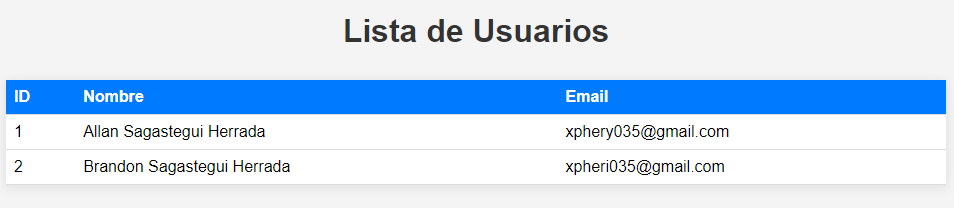

# Mi Aplicación Web

## Descripción

Esta es una aplicación web intuitiva y funcional que permite la gestión eficaz de usuarios. Diseñada con **Spring Boot** y **Thymeleaf**, la aplicación facilita el registro de nuevos usuarios y la visualización de aquellos ya existentes. Esta herramienta no solo busca simplificar el proceso de gestión de usuarios, sino también proporcionar una experiencia de usuario fluida y amigable.

---

## Estructura del Proyecto

La arquitectura del proyecto sigue un patrón de diseño de **tres capas**, lo que garantiza una separación clara de responsabilidades y un código más mantenible. Las capas son las siguientes:

- **Modelo**: Contiene las definiciones de las entidades del sistema, representando la estructura de los datos.
- **Repositorio**: Proporciona una interfaz robusta para interactuar con la base de datos, facilitando las operaciones de almacenamiento y recuperación de datos.
- **Servicio**: Encapsula la lógica de negocio, gestionando las reglas y procesos relacionados con la manipulación de datos.
- **Controlador**: Actúa como intermediario entre el modelo y la vista, manejando las solicitudes HTTP y orquestando la interacción entre ambos.
- **Vista**: Presenta la información de manera estructurada y atractiva mediante HTML y CSS, asegurando que el usuario tenga acceso a una interfaz clara y fácil de usar.

---

## Componentes

### 1. Modelo

- **Usuario**: La entidad `Usuario` representa los datos de un usuario en el sistema, incluyendo propiedades fundamentales como:
    - `id`: Identificador único generado automáticamente para cada usuario.
    - `nombre`: Nombre completo del usuario, utilizado para personalizar la experiencia.
    - `email`: Correo electrónico del usuario, que puede servir para la autenticación y notificaciones.

### 2. Repositorio

- **UsuarioRepository**: Esta interfaz extiende `JpaRepository`, lo que proporciona métodos predefinidos para realizar operaciones CRUD (Crear, Leer, Actualizar, Eliminar) de manera sencilla y eficiente. Además, permite agregar consultas personalizadas según las necesidades de la aplicación.

### 3. Servicio

- **UsuarioService**: En esta clase se centraliza la lógica de negocio. Aquí encontrarás métodos esenciales como:
    - `obtenerTodosLosUsuarios()`: Devuelve una lista de todos los usuarios registrados, facilitando su gestión.
    - `guardarUsuario(Usuario usuario)`: Método que se encarga de almacenar un nuevo usuario en la base de datos, validando los datos antes de su persistencia.

### 4. Controlador

- **UsuarioController**: Este controlador es responsable de manejar las solicitudes HTTP. Incluye métodos como:
    - `listarUsuarios()`: Proporciona la lista de usuarios a la vista, asegurando que la información esté siempre actualizada.
    - `registrarUsuario(Usuario usuario)`: Procesa el registro de un nuevo usuario, dirigiendo la información hacia el servicio para su persistencia.

### 5. Vista

- **usuarios.html**: Este archivo HTML contiene la interfaz visual de la aplicación, presentando una tabla organizada que muestra todos los usuarios registrados y un formulario intuitivo para la adición de nuevos usuarios.

### 6. Estilos

- **usuarios.css**: Esta hoja de estilos define la apariencia visual de la página de usuarios, estableciendo un diseño atractivo y responsivo que mejora la experiencia del usuario. Los estilos se aplican tanto a la tabla como al formulario, asegurando una presentación uniforme y profesional.

---

## Interfaz de Usuario

### Lista de Usuarios

*En esta sección, los usuarios pueden ver rápidamente todos los registros existentes, facilitando la identificación y gestión de cada uno de ellos.*

### Formulario de Registro

*Este formulario está diseñado para ser intuitivo, permitiendo a los usuarios registrar nuevos miembros de manera rápida y sin complicaciones.*

---

## Requisitos

Para ejecutar la aplicación, asegúrate de contar con los siguientes requisitos:

- JDK 17 o superior
- Maven
- Spring Boot
- Thymeleaf
- Base de datos correctamente configurada

---

## Instrucciones para Ejecutar

Para poner en marcha la aplicación, sigue estos simples pasos:

1. Clona el repositorio desde GitHub.
2. Navega a la carpeta del proyecto utilizando tu terminal.
3. Ejecuta el comando `mvn spring-boot:run` para iniciar la aplicación.
4. Accede a la interfaz en tu navegador mediante la URL `http://localhost:8080/usuarios`.

---

## Contribuciones

Las contribuciones son siempre bienvenidas. Si deseas colaborar con mejoras, correcciones o nuevas características, por favor abre un issue o un pull request en el repositorio.

---

## Opinión Personal

Como desarrollador, crear esta aplicación web ha sido una experiencia enriquecedora. La implementación de **Spring Boot** junto con **Thymeleaf** ha facilitado el desarrollo, permitiéndome centrarme en la lógica de negocio sin preocuparme demasiado por la configuración del servidor. La separación clara de capas —modelo, repositorio, servicio, controlador y vista— ha hecho que el código sea más mantenible y fácil de entender. Esta arquitectura no solo mejora la escalabilidad del proyecto, sino que también promueve las mejores prácticas de desarrollo.

La documentación, por otro lado, ha sido fundamental para organizar mis pensamientos y asegurar que el proyecto sea accesible para otros desarrolladores. Al detallar cada componente y su funcionalidad, no solo he facilitado el proceso de onboarding para futuros colaboradores, sino que también he reforzado mi propia comprensión de la aplicación. A medida que se agregan nuevas características o se realizan mejoras, esta base de documentación servirá como un recurso invaluable.

En resumen, estoy satisfecho con el resultado final. He aprendido mucho durante este proceso, y estoy emocionado por las posibilidades futuras de este proyecto. Espero seguir expandiéndolo y mejorándolo, incorporando nuevas funcionalidades y optimizando la experiencia del usuario.